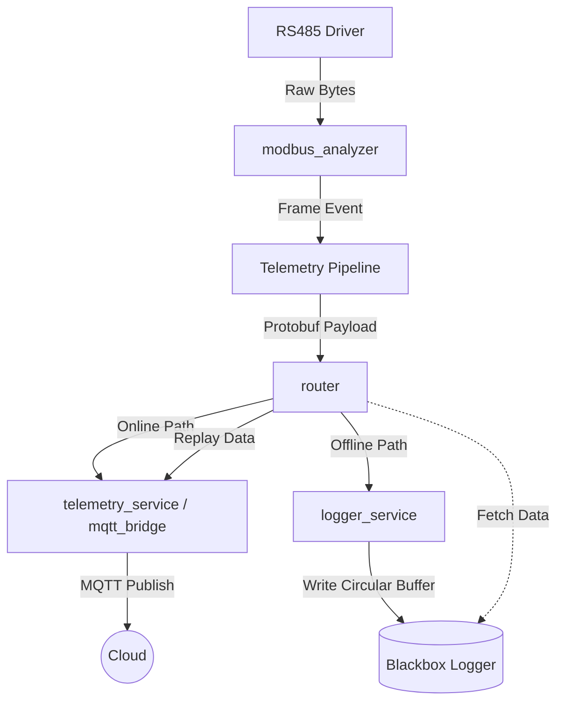
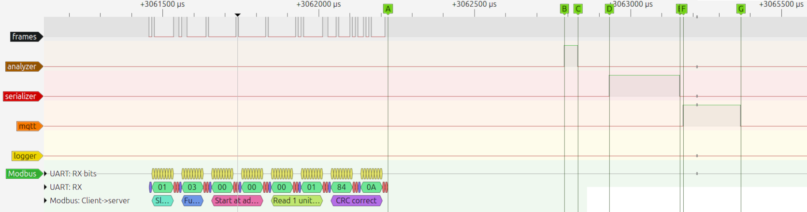
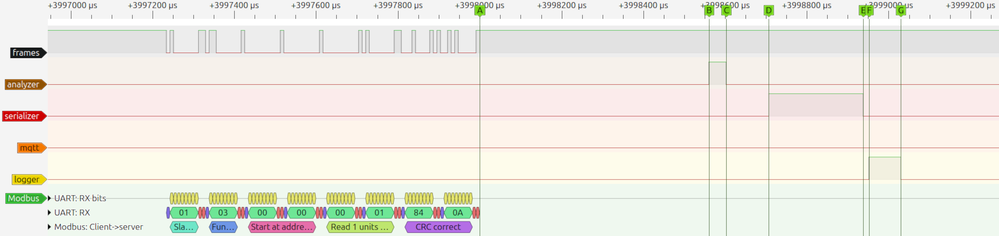
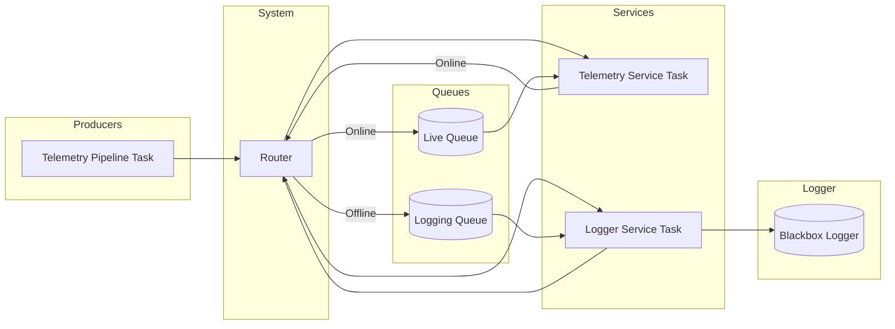
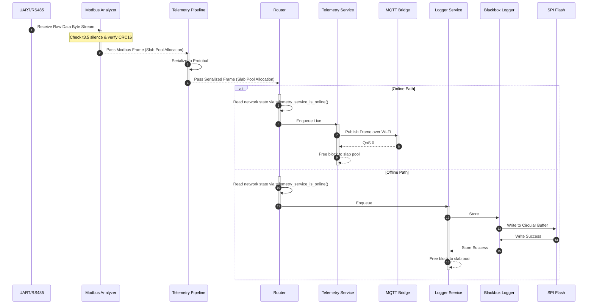
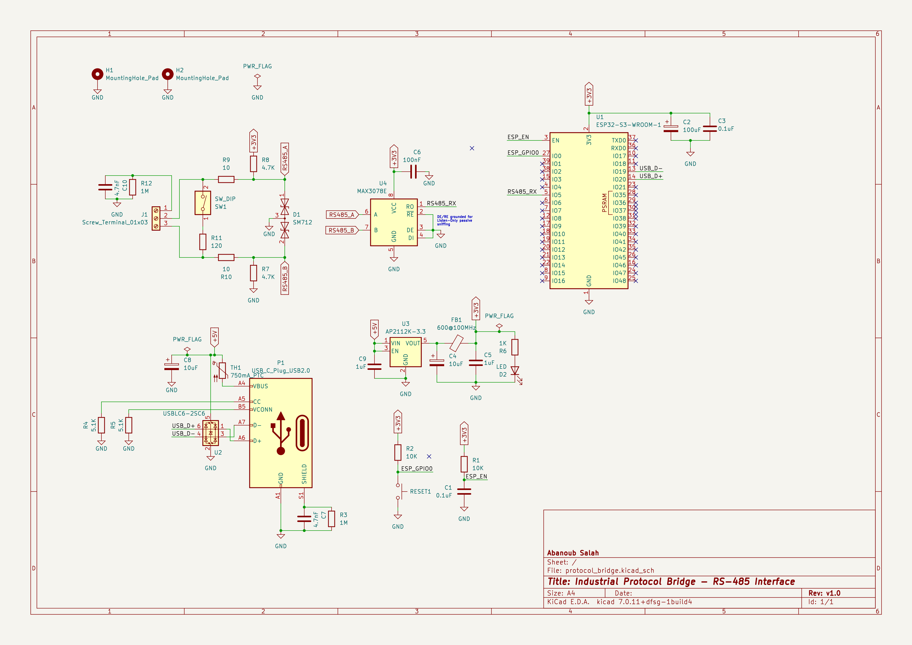
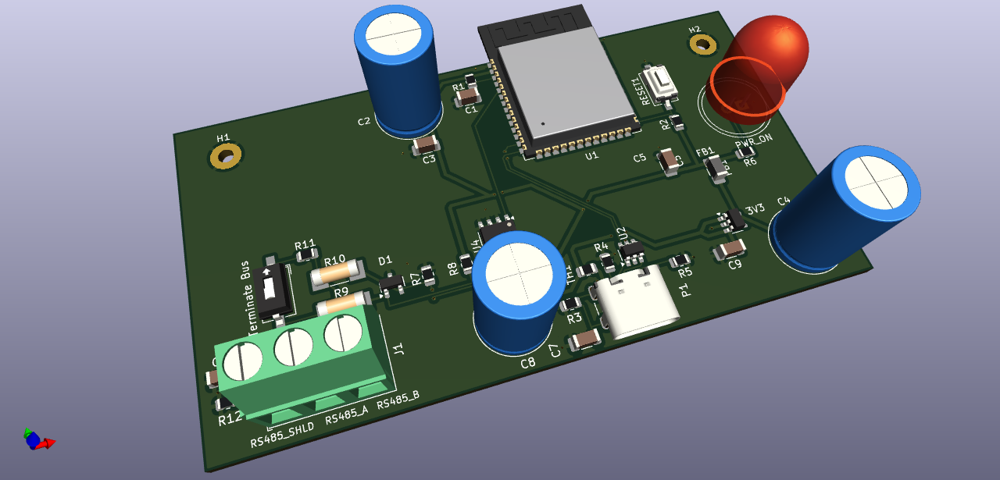

# Modbus Vault

A real-time ESP-IDF firmware project that bridges Modbus telemetry to MQTT with deterministic execution, offline buffering, and replay support.

The system is designed around clean separation of concerns, bounded RTOS work, and resilient telemetry delivery.


## Overview

Modbus Vault collects frames from Modbus devices, serializes them into compact payloads, and routes them to either MQTT or flash-backed storage depending on connectivity. When the network returns, stored data is replayed automatically.

## Why This Project Exists

Industrial telemetry systems often need to keep running during network outages.

This project focuses on:

- predictable execution under load
- offline-first telemetry handling
- controlled replay after reconnection
- clear firmware/hardware co-design


## Key features

- Deterministic RTOS design with bounded work per activation
- Event-driven architecture with queues and task notifications
- Offline buffering with flash-backed circular storage
- Replay support for stored telemetry
- Custom slab allocator to reduce heap fragmentation
- CRC-validated persistent storage
- Modular ESP-IDF component structure


## Software Architecture

The firmware is split into four main layers:

1. **Telemetry Pipeline**  
Parses Modbus frames and serializes them for transport.

2. **Router**  
Makes a fast online/offline decision and forwards payloads to the correct service.

3. **Telemetry Service**  
Publishes live and replayed telemetry over MQTT.

4. **Logger Service**  
Stores telemetry during outages and feeds replay data in bounded batches.

This design separates the control plane from the data path and keeps runtime behavior predictable.


### Project Structure

* `components/` -> core firmware modules
* `main/` -> application entry point
* `tools/` -> Python tooling for telemetry and logs
* `test_modbus_vault/` -> Unity-based tests
* `docs/` -> diagrams and generated documentation


### Example Output

```text
S python scripts/parseLiveTelemetry.py 
Listening for messages... Press Ctrl+C to exit.
Successfully connected to the MQTT broker.

devices/pub01/modbus/live
Modbus Frame:
-------------
Timestamp (us): 470139370
Slave Address : 1
Function Code : 3
Data Length   : 8
Raw Data      : [0x01 0x03 0x00 0x00 0x00 0x01 0x84 0x0A]

devices/pub01/modbus/live
Modbus Frame:
-------------
Timestamp (us): 470149446
Slave Address : 1
Function Code : 3
Data Length   : 7
Raw Data      : [0x01 0x03 0x02 0x00 0x00 0xB8 0x44]

----------------------------------------------
Metrics Received:
        RS485 overflow error(s)   :          0
        RS485 parity error(s)     :          0
        Modbus CRC error(s)       :          0
        Modbus overflow error(s)  :          0
        Modbus no_mem error(s)    :          0
        Telemetry publish error(s):          0
        Logger write error(s)     :          0

devices/pub01/modbus/replay
Modbus Frame:
-------------
Timestamp (us): 73671620
Slave Address : 1
Function Code : 3
Data Length   : 7
Raw Data      : [0x01 0x03 0x02 0x00 0x00 0xB8 0x44]

```


### System Diagram


### Data Flow




#### Online (Live Telemetry)


|  |
| :---: |
| ***Online Path PulseView capture*** |

| Interval | Time (us) | Description                                   |
| -------- | --------- | --------------------------------------------- |
| A:B      | ~565      | End of UART frame to start of frame slicing   |
| B:C      | ~44       | Analyzer task time                            |
| C:D      | ~100      | CRC check to serializer queue                 |
| D:E      | ~226      | telemetry_pipeline (Serializer) task time     |
| E:F      | ~10       | Routing callback                              |
| F:G      | ~2200     | telemetry_service (MQTT publishing) task time |


#### Offline (Buffering)


|  |
| :---: |
| ***Offline Path PulseView capture*** |

| Interval | Time (us) | Description                                 |
| -------- | --------- | ------------------------------------------- |
| A:B      | ~561      | End of UART frame to start of frame slicing |
| B:C      | ~42       | Analyzer task time                          |
| C:D      | ~104      | CRC check to serializer queue               |
| D:E      | ~231      | telemetry_pipeline (Serializer) task time   |
| E:F      | ~14       | Routing callback                            |
| F:G      | ~78       | logger_service "Entry logging" task time    |

#### Replay


### Real-Time Design

The system is designed for **deterministic execution** in an RTOS environment:

* Tasks process a **bounded number of items per activation**
* No task drains queues completely (prevents CPU starvation)
* Replay is executed in **quota-limited batches**
* Work is **event-driven** using queues and task notifications
* Flash operations are isolated from time-critical paths

This ensures predictable behavior even under:

* High telemetry rates
* Network outages
* Replay recovery scenarios


### Task Model

Each service runs as a dedicated FreeRTOS task:

| Task               | Responsibility                           |
| :----------------- | :--------------------------------------- |
| Telemetry Pipeline | Serialization                            |
| Telemetry Service  | MQTT publishing (live + replay)          |
| Logger Service     | Flash persistence and replay feeding     |
| System Controller  | Application Lifecycle                    |

### Scheduling Principles

* **Foreground work**

  * Live publish
  * Offline logging

* **Background work**

  * Replay of stored data

Foreground tasks always take priority over background recovery.

### Task Interaction & Queues

The system uses dedicated queues and event-driven tasks to ensure deterministic execution and clear ownership of responsibilities.



### Notes

* Each queue has a **single consumer**, ensuring deterministic behavior
* Tasks are **event-driven** and activated via queue + notification coupling
* **Telemetry Service** prioritizes live data over replay data
* **Logger Service** handles both persistence and replay generation through Blackbox Logger
* Replay is fed in **bounded batches** to prevent system overload


### System Interactions




### Configuration & Persistence
* The system utilizes a custom NVS Manager to abstract flash operations and ensure data integrity
    * Flush Policy: Changes are buffered in RAM and flushed to flash every 30 seconds to minimize flash wear. Configurable in `components/nvs_manager/private_include/nvs_manager_internal.h`
    * Integrity: All stored blobs are protected by a Modbus-compatible CRC16. Corrupted data results in an automatic fallback to default or shadow configurations.
    * State Recovery: Persistent storage includes WiFi credentials, MQTT configurations and Blackbox Logger parameters.
* Blackbox Logger circular storage preserves buffered telemetry across reboots.


### Serialization Notes

The project uses Protocol Buffers for compact binary log serialization.

Field numbering is treated as stable to preserve backward compatibility
with previously captured logs. Future schema evolution should use
additive changes where possible and reserve deprecated field IDs.


## Security & Network Provisioning
### Unified Provisioning Flow (BLE)

On clean installations, or when NVS values return empty string sentinels, the firmware boots into provisioning mode:

* Uses ESP-IDF's *network_provisioning* and *protocomm* components over Bluetooth Low Energy.
* Uses protocomm sec1 to exchange credentials without plaintext exposure.
* Once the client app commits valid network configurations, save the state, updates NVS, and executes an automated system reboot `esp_restart()`.

*Espressif's Android app "com.espressif.provble" was used during development & testing.*

#### Protocomm Schemas Choice

During the architectural design phase, both Security 1 and Security 2 schemes were evaluated:

* *Security 2 (SRP6a):* While it is the most secure choice, it requires off-chip pre-calculation of a unique salt/verifier. This architecture was deferred to keep the development scope focused on core real-time telemetry pipelines.
* *Security 1 (Curve25519 + AES-CTR):* Selected as the optimal choice for this deployment. It utilizes an *X25519 key exchange* to establish a secure session key over the air, combined with a *Proof of Possession (PoP)* string as a pre-shared secret for authentication.

### MQTT Credential Provisioning

MQTT mTLS credentials are handled separately from standard variable structures to prevent heap fragmentation and safely managed inside a custom *certs* partition:

* Memory-Mapped: High-speed, read-only mapping directly via MMU `esp_partition_mmap`.
* Certificates/key Partition Layout:
  * Certificates/Key (payload) are serialized, each null-terminated to be parsed correctly by MQTT stack as standard string.
  * Serialized payload are encased between a header and a Modbus CRC16. CRC is calculated across the entire block (padded-header + payload + alignment-padding) for data integrity.
  * Header is padded to 32 Bytes and the whole structure is padded to 32 Bytes to satisfy Flash encryption requirement.
  * Since *MMU* requires 64KB addressable memory (pages) the partition start offset must be aligned to 64KB.

<table style="width: 100%;">
    <caption style="font-weight: bold; font-size: 1.2em; margin-bottom: 8px;">
      Header Structure
  </caption>
  <thead>
    <tr>
      <th rowspan="2" style="text-align: center;">magic</th>
      <th colspan="2" style="text-align: center;">client certificate</th>
      <th colspan="2" style="text-align: center;">client key</th>
      <th colspan="2" style="text-align: center;">CA</th>
      <th rowspan="2" style="text-align: center;">padding</th>
    </tr>
    <tr>
      <th style="text-align: center;">offset</th>
      <th style="text-align: center;">len</th>
      <th style="text-align: center;">offset</th>
      <th style="text-align: center;">len</th>
      <th style="text-align: center;">offset</th>
      <th style="text-align: center;">len</th>
    </tr>
  </thead>
  <tbody>
    <tr>
      <td style="text-align: center;">32-bits</td>
      <td style="text-align: center;">32-bits</td>
      <td style="text-align: center;">32-bits</td>
      <td style="text-align: center;">32-bits</td>
      <td style="text-align: center;">32-bits</td>
      <td style="text-align: center;">32-bits</td>
      <td style="text-align: center;">32-bits</td>
      <td style="text-align: center;">32-bits</td>
    </tr>
  <tr>
    <td colspan=8 style="text-align: center;"><strong>32 Bytes</strong></td>
  </tr>
  </tbody>
</table>

<table style="width: 100%;">
  <caption style="font-weight: bold; font-size: 1.2em; margin-bottom: 8px;">
    Partition Layout
  </caption>
  <thead>
    <tr>
      <th style="text-align: center;">padded-header</th>
      <th style="text-align: center;">client-certificate</th>
      <th style="text-align: center;">client-key</th>
      <th style="text-align: center;">CA-certificate</th>
      <th style="text-align: center;">padding</th>
      <th style="text-align: center;">modbus-crc-16</th>
    </tr>
  </thead>
  <tbody>
    <tr>
      <td rowspan="2" style="text-align: center; vertical-align: middle;">32 Bytes</td>
      <td style="text-align: center;">data</td>
      <td style="text-align: center;">data</td>
      <td style="text-align: center;">data</td>
      <td rowspan="2" style="text-align: center; vertical-align: middle;">0 to 31 Bytes</td>
      <td style="text-align: center;">2 Bytes</td>
    </tr>
    <tr>
      <!-- Note: padded-header is skipped here because of rowspan -->
      <td style="text-align: center;">(Nul-terminated)</td>
      <td style="text-align: center;">(Nul-terminated)</td>
      <td style="text-align: center;">(Nul-terminated)</td>
      <!-- Note: padding is skipped here because of rowspan -->
      <td style="text-align: center;">32B Aligned</td>
    </tr>
  <tr>
    <td colspan=8 style="text-align: center;"><strong>Multiple Of 32 Bytes</strong></td>
  </tr>
  </tbody>
</table>


*`openssl` was used to generate certificates/keys for testing*

### Certificates/Key Provisioning

A python script `tools/scripts/provisionDevice.py` was developed to pack them into a binary and uses `esptool` to flash the binary depending on flags:

* *Development Mode `--mode plain`:* Pass unencrypted data directly.
* *Production Mode `--mode device-encrypted`:* Pass unencrypted data to *esptool* that uses the configured pre-fused chip HW to encrypt data to flash.
* *Host-Side Mode `--mode host-encrypted`:* Uses a local key and *espsecure* to pre-encrypt data before sending it.

### Provisioning Security Configuration

By default, this repository builds with an unencrypted, insecure configuration so it runs out-of-the-box on standard hardware. To enable *BLE Provisioning* and *MQTT over mTLS*, you will need to enable these features manually via the ESP-IDF configuration menu.

#### Open the Configuration Menu

Run project configuration:

```bash
idf.py menuconfig

```

#### Configure BLE Provisioning

* Navigate to **Modbus Vault Settings** -> Select **Network Configuration**.
* Under **Wi-Fi Credential Source Mode**, select **BLE Provisioning**.
* Navigate to **Component config** -> **Protocomm**.
* Ensure that **Security 1** is checked.
* [Optional] Choose **NimBLE** stack. As it is lighter and has smaller footprint.

#### Configure MQTT Over MTLS

* Navigate to **Modbus Vault Settings** -> **MQTT Client Configuration**.
* Ensure **Enable mTLS Security** is enabled.
* Make sure MQTT URI matches your broker's `mqtts://host:8883`

#### Save And Build

Press `s` to save your changes to your local `sdkconfig`, press `q` to exit, and then build normally:

```bash
idf.py build flash monitor

```

### Production Considerations

⚠️ **WARNING:** Enabling Flash Encryption permanently modifies the chip's eFuses. Misconfiguration can permanently lock or brick your development board.

To protect your provisioned WiFi/MQTT credentials from physical data extraction, it is highly recommended to enable <u>Flash Encryption</u> and <u>Encrypted NVS</u> on production/release.

Ensure you test thoroughly in development mode before freezing eFuses for Production/Release mode!

To safely configure hardware security, always follow the official Espressif documentation

### Reference Links
* [ESP-IDF Unified Provisioning](https://docs.espressif.com/projects/esp-idf/en/v6.0/esp32s3/api-reference/provisioning/provisioning.html)
* [Espressif Official Documentation: Flash Encryption](https://docs.espressif.com/projects/esp-idf/en/v6.0/esp32s3/security/flash-encryption.html)
* [Espressif Official Documentation: NVS Encryption](https://docs.espressif.com/projects/esp-idf/en/v6.0/esp32s3/api-reference/storage/nvs_encryption.html)


## Hardware
### Circuit Design

The hardware interface is designed in KiCad and built around:

* ESP32-S3-WROOM-1 MCU
* MAX3078E RS-485 transceiver
* SM712 TVS protection
* USB-C power input
* AP2112K-3.3 regulator
* Optional 120 Ω bus termination
* 750 mA resettable fuse

The board documentation and BOM describe the protection, termination, and power path choices in more detail.

<table width="100%">
  <tr>
    <!-- Left Column: Schematic -->
    <td align="center" valign="center" width="50%">
      <a href="docs/images/schematic.png">
        
      </a>
      <br>
      <sub> Circuit Schematic (Click to enlarge)</sub>
    </td>
    <!-- Right Column: 3D View -->
    <td align="center" valign="center" width="50%">
      <a href="docs/images/3dView.png">
        
      </a>
      <br>
      <sub> Hardware 3D View (Click to enlarge)</sub>
    </td>
  </tr>
</table>

### Bill of Materials (BOM)

| Reference | Value | Package/Footprint | Description |
| --------- | ----- | ----------------- | ----------- |
| U1 | ESP32-S3-WROOM-1 | Module_ESP32-S3 | Dual-core Wi-Fi/BT MCU |
| U2 | USBLC6-2SC6 |SOT-23-6| ESD protection of VBUS |
| U3 | AP2112K-3.3 |SOT-23-5| Stable Low-Dropout (LDO) regulator |
| U4 | MAX3078E |SOIC-8| RS-485 Transceiver. 1/8-unit load receiver |
| D1 | SM712 | SOT-23 | ESD protection TVS diode array  |
| D2 | Red_LED | LED_D10.0mm | Power indicator |
| C1, C3 | 0.1u F | C_1206_3216Metric | Decoupling caps |
| C2 | 100u F | Capacitor_THT:C_Radial | Power filtering |
| C4, C8 | 10u F | Capacitor_THT:C_Radial_D10.0mm_H16.0mm_P5.00mm | Power filtering |
| C5, C9 | 1u F | C_1206_3216Metric | Decoupling caps |
| C6 | 100n F | C_1206_3216Metric | Power filtering |
| C7, C10| 4.7n F | C_1206_3216Metric | DC blocking |
| FB1 | 600 Ω @ 100M Hz | 1206 | Suppress EMI |
| H1, H2 | Mounting Hole Pad | MountingHole_2.2mm_M2_Pad | Hold PCB |
| J1 | Screw Terminal 01x03 | TerminalBlock_Phoenix_MKDS-1,5-3-5.08_1x03_P5.08mm_Horizontal | A and B bus signals and Shield |
| P1 | USB-C Plug USB 2.0 | USB_C_Receptacle_GCT_USB4105-xx-A_16P_TopMnt_Horizontal | Provides power and communication with ESP |
| R1, R2 | 10K Ω | 0805 | Pull-Up resistors |
| R3, R12| 1M Ω | 0805 | Suppress EMI |
| R4, R5 | 5.1K Ω | 0805 | Pull-Down resistors |
| R6 | 1K Ω | 0805 | Current limiting |
| R7, R8 | 4.7K Ω | 0805 | Pull up/down resistors |
| R9, R10 | 10 Ω | R_MELF_MMB-0207 | Pulse load capability |
| R11 | 120 Ω | 0805 | Optional bus termination |
| RESET1 | SW_Tactile_SPST | SW_Tactile_SPST | ESP reset button |
| SW1 | SW_DIP | SW_DIP_SPSTx01_Slide | Enable/disable termination resistor |
| TH1 | 750mA PTC | Fuse_0805 | Resettable fuse |


## Testing & CI
This project follows a test-driven approach to ensure reliability in industrial environments. Logic validation is performed via QEMU Emulation (Xtensa LX7), allowing for 100% reproducible CI/CD pipelines.
* Framework: Unity (ESP-IDF Integrated)
* Environment: Automated QEMU Simulation
* Total Test Cases: 28
* Key Validations:
    * Resilience: Power-loss recovery & torn-write skipping.
    * Integrity: CRC validation and Fuzz testing for corruption resilience.
    * Drivers: RS485 state machine and NVS manager safety.
* Unit-tested critical components:
    * RS485 driver
    * Modbus parsing
    * Blackbox logger (with mocks)
    * NVS manager (fault recovery scenarios)

Output sample

```text
...
Running NVS Manager Initialization...
W (1253) NVS_MANAGER: Configurations load fail, reverting to default values
I (1253) NVS_MANAGER: Initialized
modbus_vault/components/nvs_manager/test/test_nvs_manager.c:25:NVS Manager Initialization:PASS
Running NVS Read/Write WiFi Credentials...
W (1253) NVS_MANAGER: Configurations load fail, reverting to default values
I (1253) NVS_MANAGER: Initialized
modbus_vault/components/nvs_manager/test/test_nvs_manager.c:32:NVS Read/Write WiFi Credentials:PASS
Running NVS Read/Write Numeric Values...
W (1263) NVS_MANAGER: Configurations load fail, reverting to default values
I (1263) NVS_MANAGER: Initialized
modbus_vault/components/nvs_manager/test/test_nvs_manager.c:53:NVS Read/Write Numeric Values:PASS
Running NVS Out of Bounds Key...
modbus_vault/components/nvs_manager/test/test_nvs_manager.c:73:NVS Out of Bounds Key:PASS
Running NVS Manager CRC Integrity...
W (1263) NVS_MANAGER: Configurations load fail, reverting to default values
I (1263) NVS_MANAGER: Initialized
I (1273) NVS_MANAGER: Initialized
modbus_vault/components/nvs_manager/test/test_nvs_manager.c:81:NVS Manager CRC Integrity:PASS
Running RS485 Driver Init/Deinit...
I (1333) uart: queue free spaces: 20
I (1343) RS485_DRIVER: Initialized
modbus_vault/components/rs485_driver/test/test_rs485_driver.c:16:RS485 Driver Init/Deinit:PASS
Running RS485 Driver Init Failure Safety...
E (1343) uart: uart_driver_install(2000): uart rx buffer length error
W (1353) RS485_DRIVER: Failed to initialize: (ESP_FAIL).
I (1353) RS485_DRIVER: RS485 Driver de-initialized
modbus_vault/components/rs485_driver/test/test_rs485_driver.c:25:RS485 Driver Init Failure Safety:PASS
Running Serializer Encode Modbus Success...
modbus_vault/components/serializer/test/test_serializer.c:8:Serializer Encode Modbus Success:PASS

-----------------------
28 Tests 0 Failures 0 Ignored 
OK
I (1363) main_task: Returned from app_main()
QEMU: Terminated
Done
```


## Getting Started

### Prerequisites

  * ESP-IDF v6.x
  * ESP32-S3 target
  * protoc-c for generating the C protobuf sources

### Runtime Configuration

Network and broker credentials are configured at build time through `menuconfig`:
```bash
idf.py menuconfig
```

Set:

* Wi-Fi SSID / Password
* MQTT broker URI
* MQTT credentials
* MQTT device ID

> No production credentials are stored in source control. All deployment-specific settings are injected during build configuration.

> Credentials are persisted for operational continuity. For production deployments, secure boot, flash encryption, and encrypted NVS should be enabled as part of the platform hardening profile.


### Build & Flash

```bash
# Set up the environment
. $IDF_PATH/export.sh

# Build the project
idf.py build

# Flash and monitor
idf.py flash monitor
```

> Protobuf sources and headers are generated during the build process from `components/serializer/proto/modbus.proto`

### Running Tests

```bash
cd test_modbus_vault
idf.py build qemu
```


### Documentation
To generate API documentation run:

```bash
doxygen Doxyfile
```


## Developer Tooling

The `tools/` folder includes scripts for:

* Generate sample log files
* Parsing live MQTT telemetry
* Decoding binary log dumps
* Simulating Modbus transactions

> Enables full system observability and debugging

> Check out the `tools/` folder for more details


## Future Improvements

* Graceful shutdown and brownout-aware persistence
* Power-saving operational modes
* Local web dashboard
* OTA firmware updates


## License

MIT License

